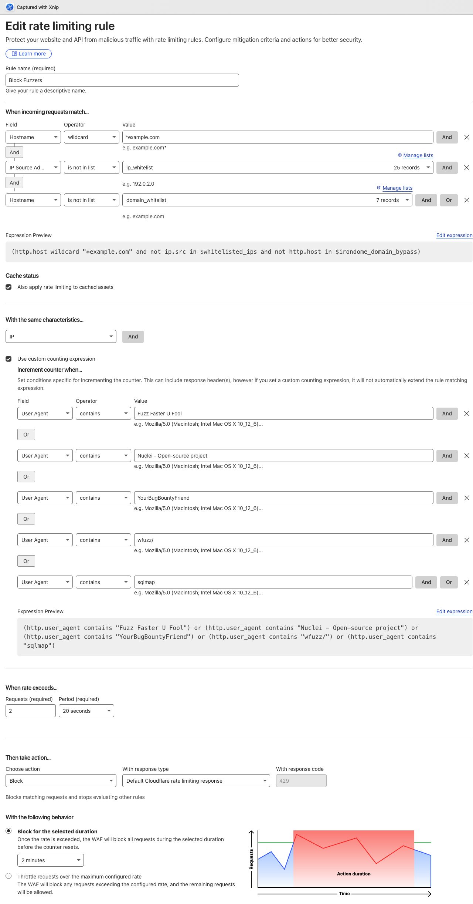

# Web Application Firewall (WAF), Distributed Denial of Service (DDoS) and Bot Protection

Configuring a Web Application Firewall (WAF) demands significant time and effort, yet it's a critical measure for reducing noise and fortifying the security posture of organizational applications. Most WAFs have advanced features that can be customized to meet specific needs but its up to the organization to define and implement these rules effectively.

Besides the common outcomes described bellow, some more exotic techniques may include:

* **Set a rate limit rule that blocks all requests from an IP addresses that reaches a specified threshold or error codes (4xx, 5xx):** This may need to be tweaked based on organization business logic. For example, if the product is a mobile app and all requests are scoped based on the user permissions, a 403 due to user trying to access requests of another user should never happen so there is some confidence in blocking the IP after a few 403 errors.
* **Set rate limit rules for common enumeration paths**: For example, if requests are done to /.git, /wp-admin (and you don't use wordpress), /.env, etc. you can set a rate limit rule that blocks the IP after a few requests to these paths as it is most likely a scanner or bot.
* **Setup specifc requirements for all requests:** If the underlying backends are not expecting requests from any source, a set of required headers can be enforced. For example, if the backend is expecting requests from a mobile app or browser, these clients can send a specific header with some hardcoded value, that is then checked by the WAF. If the header is not present or the value is incorrect, the request can be blocked. This can help block a lot of generic scanners and bots that are not aware of this requirement.

⚠️ Don't forget to allow exceptions for the previous rules. There will always be use cases that will trigger these rules and you don't want to block legitimate use cases.

A common issue when applying these rules (for example in cloudflare) is that the rules are only created to block the requests triggering the rules and not the full IP, so although you already know the IP is already doing reconnaissance or  malicious activity the WAF is only blocking the requests that trigger the rules meaning that a good percentage of requests can still go through. This is why its important to use Rate limit rules for these use cases, instead of regular security rules.
The following image demonstrates an example of how to achieve this:

## Outcome

* [ ] Implement a WAF in front of all web traffic
* [ ] Block known attacks like sql injection, xss, or specific CVEs
* [ ] Rate limits are in place, and sensitive endpoints have stricter limits
* [ ] Scanners and bots are detected and blocked as needed
* [ ] DDoS Protection in place
* [ ] Rule changes are monitored and audited
* [ ] Captchas are presented to users when bot activity is suspected
* [ ] Security headers are injected by the WAF

## Metrics

* [ ] Number of requests blocked
* [ ] Percentage of traffic served
* [ ] Endpoints/Servers with the most blocked requests
* [ ] Bot verification requests
* [ ] Scans/Attacks detected and blocked

## Tools & Resources

* [CloudFlare](https://www.cloudflare.com/) (Paid)
* [AWS WAF](https://aws.amazon.com/waf/) (Paid)
* [Akamai](https://www.akamai.com/) (Paid)
* [Imperva](https://www.imperva.com/) (Paid)
* [DataDome](https://datadome.co/) (Paid)
* [Awesome Waf](https://github.com/0xInfection/Awesome-WAF) (Free)
* [Cloudflare-WAF-Expressions](https://github.com/sefinek/Cloudflare-WAF-Expressions) (Free)

## Further Reading

* [When WAFs Go Awry: Common Detection & Evasion Techniques for Web Application Firewalls](https://www.mdsec.co.uk/2024/10/when-wafs-go-awry-common-detection-evasion-techniques-for-web-application-firewalls)
